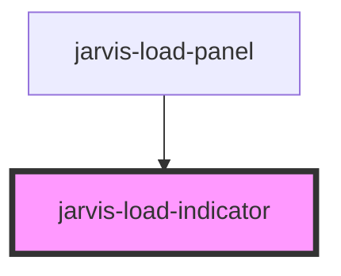

# jarvis-load-indicator

<!-- Auto Generated Below -->

## Properties

| Property    | Attribute    | Description | Type                           | Default     |
| ----------- | ------------ | ----------- | ------------------------------ | ----------- |
| `label`     | `label`      |             | `string`                       | `'Loading'` |
| `layout`    | `layout`     |             | `"inline" \| "stacked"`        | `'inline'`  |
| `message`   | `message`    |             | `string`                       | `''`        |
| `showLabel` | `show-label` |             | `boolean`                      | `false`     |
| `size`      | `size`       |             | `"lg" \| "md" \| "sm" \| "xl"` | `'md'`      |
| `type`      | `type`       |             | `"bars" \| "dots" \| "ring"`   | `'ring'`    |
| `visible`   | `visible`    |             | `boolean`                      | `true`      |

## Shadow Parts

| Part        | Description |
| ----------- | ----------- |
| `"base"`    |             |
| `"message"` |             |

## Dependencies

### Used by

 - [jarvis-load-panel](../load-panel)

### Graph

----------------------------------------------

*Built with [StencilJS](https://stenciljs.com/)*
