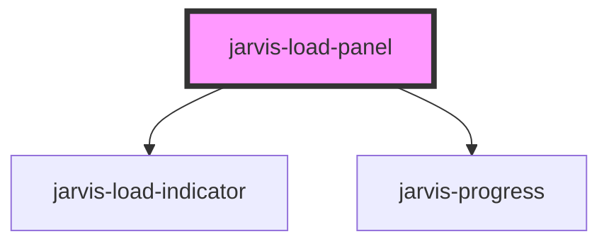

# jarvis-load-panel

<!-- Auto Generated Below -->

## Properties

| Property              | Attribute                | Description | Type                           | Default        |
| --------------------- | ------------------------ | ----------- | ------------------------------ | -------------- |
| `cancelLabel`         | `cancel-label`           |             | `string`                       | `'Cancel'`     |
| `closeOnOutsideClick` | `close-on-outside-click` |             | `boolean`                      | `false`        |
| `description`         | `description`            |             | `string`                       | `''`           |
| `heading`             | `heading`                |             | `string`                       | `''`           |
| `indicatorSize`       | `indicator-size`         |             | `"lg" \| "md" \| "sm" \| "xl"` | `'md'`         |
| `indicatorType`       | `indicator-type`         |             | `"bars" \| "dots" \| "ring"`   | `'ring'`       |
| `message`             | `message`                |             | `string`                       | `'Loading...'` |
| `progressValue`       | `progress-value`         |             | `number`                       | `-1`           |
| `showCancelButton`    | `show-cancel-button`     |             | `boolean`                      | `false`        |
| `showIndicator`       | `show-indicator`         |             | `boolean`                      | `true`         |
| `showOverlay`         | `show-overlay`           |             | `boolean`                      | `true`         |
| `showPane`            | `show-pane`              |             | `boolean`                      | `true`         |
| `visible`             | `visible`                |             | `boolean`                      | `false`        |

## Events

| Event                    | Description | Type                                 |
| ------------------------ | ----------- | ------------------------------------ |
| `jarvisCancel`           |             | `CustomEvent<void>`                  |
| `jarvisVisibilityChange` |             | `CustomEvent<{ visible: boolean; }>` |

## Methods

### `hide() => Promise<void>`

#### Returns

Type: `Promise<void>`

### `show() => Promise<void>`

#### Returns

Type: `Promise<void>`

## Shadow Parts

| Part            | Description |
| --------------- | ----------- |
| `"base"`        |             |
| `"content"`     |             |
| `"description"` |             |
| `"heading"`     |             |
| `"indicator"`   |             |
| `"message"`     |             |
| `"overlay"`     |             |
| `"panel"`       |             |
| `"progress"`    |             |

## Dependencies

### Depends on

- [jarvis-load-indicator](../load-indicator)
- [jarvis-progress](../progress)

### Graph

----------------------------------------------

*Built with [StencilJS](https://stenciljs.com/)*
