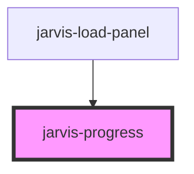

# jarvis-progress

<!-- Auto Generated Below -->

## Properties

| Property         | Attribute          | Description | Type                                              | Default     |
| ---------------- | ------------------ | ----------- | ------------------------------------------------- | ----------- |
| `helperText`     | `helper-text`      |             | `string`                                          | `''`        |
| `indeterminate`  | `indeterminate`    |             | `boolean`                                         | `false`     |
| `label`          | `label`            |             | `string`                                          | `''`        |
| `showValueLabel` | `show-value-label` |             | `boolean`                                         | `false`     |
| `tone`           | `tone`             |             | `"danger" \| "neutral" \| "success" \| "warning"` | `'neutral'` |
| `value`          | `value`            |             | `number`                                          | `0`         |
| `valueSuffix`    | `value-suffix`     |             | `string`                                          | `'%'`       |

## Shadow Parts

| Part          | Description |
| ------------- | ----------- |
| `"indicator"` |             |
| `"track"`     |             |

## Dependencies

### Used by

 - [jarvis-load-panel](../load-panel)

### Graph

----------------------------------------------

*Built with [StencilJS](https://stenciljs.com/)*
